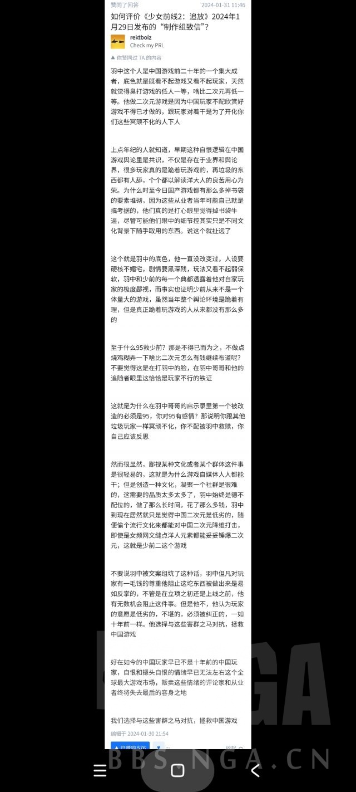

### [杂谈氵] 或许这才是许多二游频繁暴雷的本质原因

Made by ngapost2md (c) ludoux [GitHub Repo](https://github.com/ludoux/ngapost2md)

----

##### 0.[1] \<pid:0\> 2024-02-01 01:02:14 by 左岸●右转

----

##### 1.[0] \<pid:740931120\> 2024-02-01 01:06:12 by 游戏批评Z
来自二次元的战马行动，还拯救中国游戏呢

----

##### 2.[3] \<pid:740931289\> 2024-02-01 01:07:59 by 长白夜
笑点解析“集大成者”

----

##### 3.[4] \<pid:740931362\> 2024-02-01 01:08:45 by schiller2333
是吗？
“二游频繁暴雷”是有二游以来长期、稳定的周期性暴雷的吗？
还是近几年才开始高频暴雷的呢？

----

##### 4.[0] \<pid:740931409\> 2024-02-01 01:09:12 by warland
二刺猿贴膜就别往自己脸上贴金了，本来二贴就是小类，还代表上行业了

----

##### 5.[0] \<pid:740932241\> 2024-02-01 01:18:50 by 桓远
羽中一个如此劣根性的人却在游戏领域存活了这么多年，他还是二游圈最早的几个公司之一。
现在他在黔驴技穷的垂死挣扎，他只有死了才有点意义。
用它的死开启二游圈的反攻元年多好。

----

##### 6.[5] \<pid:740932276\> 2024-02-01 01:19:23 by COREMS
知乎游戏区说拯救中国游戏，多少有些过于纯真了
还有，当年玩家可不是跪着。单机时代是有10块钱的地摊光盘，谁去买你几百的正版。网游时代玩家直接论坛开喷，乃至于上门砸公司都有，早期互联网民风远比现在彪悍。
反倒是近几年某几家崛起之后，才逐渐演变成现在这样

----

##### 8.[1] \<pid:740932484\> 2024-02-01 01:21:49 by 黑色的玉米粒
国产二游当初也没有现在这么魔怔，也是近几年才开始的，好像是19年吧。

----

##### 9.[0] \<pid:740933517\> 2024-02-01 01:35:05 by 十六夜鬼月
>[jump](#pid740932484) 黑色的玉米粒(2024-02-01 01:21) 说: 
>
>国产二游当初也没有现在这么魔怔，也是近几年才开始的，好像是19年吧。

其实本质上就是很多老二次元自己也瞧不上自己那些爱好，觉得上不得台面。小作坊时期自娱自乐可能这种自卑还不会发作。但一旦有机会做大，就会觉得产品的格调“德不配位”。就会下意识的像“主流”看齐。至于什么是“主流”，如何看齐，那就属于他们个人的理解了。

